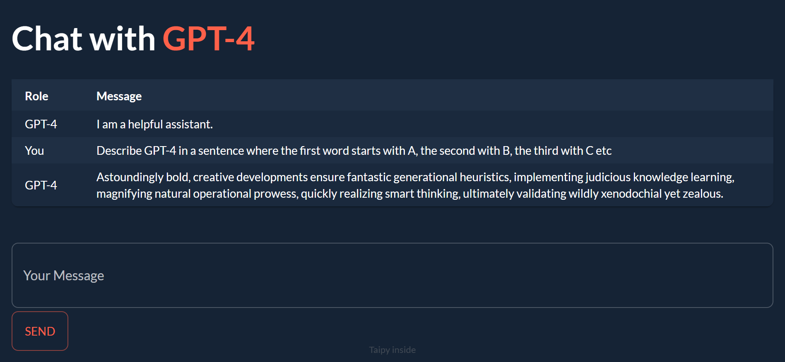

# Taipy GPT-4 Chat Demo

GPT-4 Chat Web App created in **only 80 lines of Python** using [Taipy](https://github.com/Avaiga/taipy)

<p align="center">
  
</p>

## Usage

**Important Note:** This app requires an OpenAI API key connected to an account with access to GPT-4

1. Clone this repo:

```bash
git clone https://github.com/AlexandreSajus/Taipy-GPT4-Demo.git
```

2. Install the dependencies:

```bash
pip install -r requirements.txt
```

3. Add your API key in the `app.py` file:

```python
API_KEY = "ENTER YOUR API KEY HERE"
```

4. Run the app:

```bash
python app.py
```